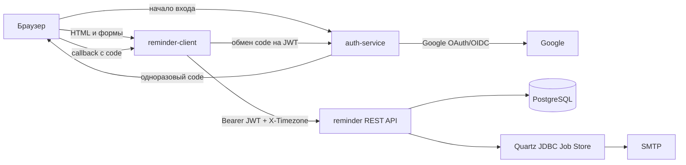

# Reminder

`Reminder` — pet-проект из трёх Spring Boot приложений для персональных
email-напоминаний. Пользователь входит через Google, получает внутренний JWT и
работает с напоминаниями через HTML-клиент или напрямую с REST API.

## Состав системы

| Компонент | Роль |
|---|---|
| `auth-service` | Вход через Google OpenID Connect, локальные пользователи в PostgreSQL, выпуск JWT и одноразовых кодов |
| `reminder-client` | Server-side HTML-клиент на Thymeleaf; хранит JWT в HttpOnly cookie и выступает BFF для браузера |
| `reminder` | REST API напоминаний, PostgreSQL, Liquibase, Quartz и отправка email |



## Быстрый запуск

Скопируйте `.env.example` в `.env`, заполните секреты Google и SMTP, затем из
корня репозитория выполните:

```powershell
docker compose up --build
```

После запуска доступны:

| Адрес | Назначение |
|---|---|
| `http://localhost:8081/client/reminder/main/bytitle` | HTML-клиент |
| `http://localhost:8080/swagger-ui/index.html` | Swagger UI REST API |

Health endpoints доступны без JWT. Для `/actuator/metrics` и
`/actuator/prometheus` требуется Bearer JWT.

## Аутентификация и авторизация

### Что делает auth-service

`auth-service` является OAuth/OIDC-клиентом Google, а не полноценным OAuth 2.0
Authorization Server. После успешного Google login он:

1. получает проверенный Spring Security объект `OidcUser`;
2. находит или создаёт локального пользователя по паре `provider=GOOGLE` и
   стабильному Google `sub`;
3. выпускает внутренний JWT, подписанный RSA-ключом;
4. создаёт одноразовый UUID-код с TTL 60 секунд вместо передачи JWT в URL;
5. перенаправляет браузер на callback `reminder-client`.

JWT содержит как минимум `sub` (UUID локального пользователя), `email`, `iss`,
`aud`, `iat`, `exp` и роли. Публичный RSA-ключ доступен по
`GET /.well-known/jwks.json`.

`reminder-client` обменивает одноразовый код на JWT через
`POST /api/auth/exchange` с HTTP Basic credentials технического клиента. Код
удаляется при первом обмене, поэтому использовать его повторно нельзя.

### Что делает reminder-client

`reminder-client` — MVC/BFF слой. Он формирует HTML через Thymeleaf, получает
JWT в callback и сохраняет его в HttpOnly cookie `ACCESS_TOKEN`. При запросах к
REST API клиент извлекает JWT из `SecurityContext` и передаёт его как
`Authorization: Bearer <JWT>`, а также добавляет `X-Timezone`.

Клиент проверяет JWT как OAuth2 Resource Server: подпись RS256, срок действия,
`iss=auth-service` и аудиторию `reminder-client`. Изменяющие HTML-формы защищены
CSRF. Страница `JWT info` оставлена только для разработки: она удобна, чтобы
скопировать токен в Swagger UI или Postman, но не должна быть доступна в публичном
production-окружении.

### Проверка JWT в REST-сервисе

`reminder` также является OAuth2 Resource Server и проверяет JWT локально по
публичному RSA-ключу. Он проверяет подпись RS256, `iss=auth-service`, наличие
`reminder-rest` в `aud` и срок действия. Поэтому временная недоступность
`auth-service` не мешает работе с уже выданными непросроченными токенами.

Идентификатор владельца всегда берётся из `sub` проверенного JWT; клиент не может
передать произвольный `userId`. Если reminder не найден или принадлежит другому
пользователю, возвращается `404`, чтобы не раскрывать существование чужого ресурса.

## Публичные URL и Docker-адреса

Есть два разных вида адресов:

- публичные — их использует браузер, например `https://auth.example.com`;
- внутренние Docker-адреса — их используют контейнеры друг для друга, например
  `http://auth-service:8082` и `http://reminder:8080`.

Для развёртывания за reverse proxy задайте:

```dotenv
AUTH_PUBLIC_BASE_URL=https://auth.example.com
REMINDER_CLIENT_PUBLIC_BASE_URL=https://reminder.example.com
JWT_COOKIE_SECURE=true
```

В production перед `auth-service` должен стоять reverse proxy, который добавляет
служебные заголовки `X-Forwarded-*`. Иначе auth-service увидит только внутренний
адрес вроде `http://auth-service:8082` и может построить неверный OAuth redirect:
с внутренним hostname или `http` вместо публичного HTTPS-адреса.
`forward-headers-strategy: framework` говорит Spring учитывать эти заголовки. При
локальном запуске всё работает и без reverse proxy: браузер напрямую обращается к
`localhost`, поэтому внешний и внутренний адреса не различаются.

### Как работают значения через двоеточие

В конструкции `${ИМЯ_ПЕРЕМЕННОЙ:значение_по_умолчанию}` первое значение — имя
подставляемой переменной, а второе — значение по умолчанию. Если переменная для
первого значения будет задана, то её значение подставится.

Все runtime-места с такой подстановкой:

| Где | Конструкция | Назначение |
|---|---|---|
| `reminder-client/application.yaml` | `${AUTH_PUBLIC_BASE_URL:http://localhost:8082}` | Публичный адрес auth-service для кнопки входа |
| `auth-service/application.yaml` | `${REMINDER_CLIENT_PUBLIC_BASE_URL:http://localhost:8081}` | Публичный callback клиента |
| `reminder-client/application.yaml` | `${JWT_COOKIE_SECURE:true}` | Флаг Secure cookie при прямом запуске клиента |
| `reminder-client/application.yaml` | `${JWT_COOKIE_MAX_AGE:15m}` | Срок жизни JWT cookie |
| `compose.yaml`, `auth-service` | `${REMINDER_CLIENT_PUBLIC_BASE_URL:-http://localhost:8081}` | Передача callback URL в контейнер |
| `compose.yaml`, `reminder-client` | `${AUTH_PUBLIC_BASE_URL:-http://localhost:8082}` | Передача URL входа в контейнер |
| `compose.yaml`, `reminder-client` | `${JWT_COOKIE_SECURE:-false}` | Cookie для локального HTTP |

В Java есть ещё defaults для TTL одноразового кода, TTL JWT, `kid` RSA-ключа и
двух задержек очистки idempotency records. Они относятся к настройке сервисов, а
не к публичным URL. Shell-выражения в `mvnw` относятся только к Maven Wrapper.

## Reminder REST API

Базовый путь: `/api/v1/reminder`. Все API endpoints, кроме Swagger/OpenAPI и
Actuator health probes, требуют:

```http
Authorization: Bearer <JWT>
```

| Метод | Путь | Назначение |
|---|---|---|
| `POST` | `/` | Создать reminder; требуется `Idempotency-Key` |
| `PATCH` | `/{reminderId}` | Частично изменить reminder; требуется `Idempotency-Key` |
| `DELETE` | `/{reminderId}` | Удалить reminder и Quartz job |
| `GET` | `/sort/title` | Страница напоминаний; default `title,desc` |
| `GET` | `/sort/date` | Страница напоминаний; default `remind,desc` |
| `GET` | `/?title={text}` | Поиск по части названия |
| `GET` | `/search-by-date?date=YYYY-MM-DD` | Напоминания за локальный день |
| `GET` | `/filter/date?start={instant}&end={instant}` | Диапазон `[start,end)` |
| `POST` | `/addsomereminders` | Два демонстрационных reminder |

Для списков поддерживаются `page`, `size` и `sort`. Разрешённые поля сортировки:
`title`, `remind`, `id`.

### Создание и частичное изменение

```http
POST /api/v1/reminder
Authorization: Bearer <JWT>
X-Timezone: Asia/Almaty
Idempotency-Key: 0e4ec7b8-0362-4f7f-841d-9e43f47ea502
Content-Type: application/json
```

```json
{
  "title": "Позвонить маме",
  "description": "После работы",
  "remind": "2026-09-01T19:00:00"
}
```

`POST` возвращает `201 Created`, `Location` и `ReminderDto`. Для `PATCH` все поля
необязательны: передаются только изменяемые значения. При изменении времени, темы
или текста Quartz job пересоздаётся с актуальным snapshot письма.

Название должно содержать 3–255 символов, описание — 3–4096 символов, время
должно находиться в будущем. `Idempotency-Key` обязателен, не может быть пустым и
ограничен 255 символами.

### Время и timezone

Поле `remind` в `POST` и `PATCH` — локальное время без offset. Сервис использует
IANA timezone из `X-Timezone`, преобразует его в `Instant` и хранит в PostgreSQL
как UTC (`TIMESTAMPTZ`). При отсутствии заголовка используется `Asia/Almaty`; это
видно в ответных заголовках `X-Timezone-Applied` и
`X-Timezone-Defaulted: true`.

Невозможные и неоднозначные локальные моменты во время перехода летнего/зимнего
времени отклоняются с `400`.

### Idempotency-Key

Клиент создаёт новый UUID для каждой новой логической операции. Если сетевой ответ
потерян, retry той же операции использует прежний UUID.

`IdempotencyRecord` хранит связь:

```text
(userId, idempotencyKey) -> reminderId
```

PostgreSQL advisory lock сериализует одновременные запросы с одинаковой парой
`userId + key`. Записи хранятся 24 часа по умолчанию.

Это осознанно упрощённая модель: ключ не хранит HTTP-метод, endpoint, ID ресурса
или fingerprint payload. UUID-коллизия для pet-проекта практически невероятна, но
один и тот же ключ нельзя использовать для другой операции.

Optimistic locking намеренно не используется: он потребовал бы дополнительный
столбец `version`, а набор столбцов reminder фиксирован заданием. При редком
конфликте двух одновременных `PATCH` действует правило «последнее сохранение
побеждает».

### Планирование и email retry

Quartz использует JDBC Job Store в той же PostgreSQL. После сохранения reminder
создаётся job `email-job-{reminderId}`. Job содержит snapshot получателя, темы и
текста письма.

При SMTP-ошибке Quartz сохраняет следующий trigger: по умолчанию всего до трёх
попыток — сразу, через 1 минуту и через 2 минуты. Retry triggers переживают
перезапуск приложения. У SMTP заданы connect/read/write timeouts.

```yaml
reminder:
  email:
    retry:
      max-attempts: 3
      initial-delay: PT1M
```

Resilience4j здесь намеренно не используется: обычный retry происходит в памяти
текущего процесса и исчезает при рестарте. Quartz уже является persistent scheduler
проекта, поэтому persistent retry хранится в нём.

Доставка имеет семантику *at least once*: при неясном результате SMTP возможен
дубликат письма. Журнал доставки намеренно не используется: он хранил бы историю
попыток и окончательные статусы писем, но не захотелось усложнять.

Transactional outbox также намеренно не используется. В этом
проекте reminder и Quartz Job Store уже находятся в одной PostgreSQL и изменяются
одной локальной транзакцией.

## Ошибки REST API

Прикладной слой возвращает единый JSON-формат:

```json
{
  "errorCode": "INVALID_TIMEZONE",
  "message": "Unknown timezone",
  "details": { "X-Timezone": "Mars/Olympus" }
}
```

| HTTP | `errorCode` | Когда |
|---|---|---|
| `400` | `VALIDATION_ERROR`, `INVALID_PARAMETER`, `MALFORMED_REQUEST` | Некорректное тело или параметр |
| `400` | `INVALID_TIMEZONE`, `INVALID_REMINDER_TIME` | Некорректное время или timezone |
| `400` | `INVALID_DATE_RANGE`, `INVALID_SORT` | Некорректный диапазон или сортировка |
| `404` | `REMINDER_NOT_FOUND` | Нет reminder владельца или он чужой |
| `409` | `IDEMPOTENCY_IN_PROGRESS` | Ключ уже обрабатывается |
| `500` | `INTERNAL_SERVER_ERROR` | Неожиданная ошибка без утечки деталей |

Ошибки JWT возникают до контроллера и следуют OAuth2 Bearer стандарту: `401` с
заголовком `WWW-Authenticate`.

## Наблюдаемость

Для pet-проекта уже добавлен минимальный Spring Boot Actuator набор. Отдельные
Prometheus, Grafana, dashboards и alert-правила не развёрнуты, но подключить их
позже можно без изменения REST API.

- `GET /actuator/health` — общее состояние;
- `GET /actuator/health/liveness` — приложение живо;
- `GET /actuator/health/readiness` — приложение готово принимать трафик и может
  подключиться к PostgreSQL;
- `GET /actuator/metrics` — метрики приложения, требуется JWT;
- `GET /actuator/prometheus` — метрики в формате Prometheus, требуется JWT.

SMTP намеренно не входит в readiness: при временной недоступности почты REST API
может сохранить reminder, а Quartz выполнит persisted retry позднее.

## Тесты

В модуле `reminder` есть unit-, MVC- и Testcontainers integration tests.

- `./mvnw.cmd test` — обычные тесты;
- `./mvnw.cmd verify` — обычные и integration tests. Maven Failsafe запускает
  integration-тесты с именем `*IT` после обычных тестов и сообщает об их результате
  на этапе `verify`.

Integration tests поднимают PostgreSQL через Testcontainers, запускают реальный
Quartz scheduler, проверяют health probes и SMTP retry. Для SMTP используется
GreenMail — изолированный тестовый SMTP-сервер: первая попытка получает отказ
соединения, затем GreenMail запускается и persisted retry доставляет письмо. Реальный
почтовый аккаунт не требуется, письма наружу не отправляются.

Windows Maven Wrapper исправлен: обычная папка `.m2` не воспринимается как
ссылка с отсутствующим `Target`, поэтому wrapper не падает до запуска Maven.

## Конфигурация

Основные параметры REST-сервиса можно переопределить environment variables:

| Переменная | Назначение |
|---|---|
| `SPRING_DATASOURCE_URL` | JDBC URL PostgreSQL |
| `SPRING_DATASOURCE_USERNAME` / `SPRING_DATASOURCE_PASSWORD` | Учётные данные БД |
| `MAIL_PASSWORD` | Пароль SMTP |
| `REMINDER_EMAIL_RETRY_MAX_ATTEMPTS` | Общее число SMTP-попыток |
| `REMINDER_EMAIL_RETRY_INITIAL_DELAY` | Начальная задержка ISO-8601, например `PT1M` |
| `REMINDER_IDEMPOTENCY_RETENTION` | Срок хранения ключей, например `PT24H` |
| `AUTH_CLIENT_SECRET` | Пароль технического клиента для обмена кода на JWT |


## Осознанные ограничения pet-проекта

- публичный RSA-ключ встроен в конфигурацию; JWKS и ротация ключей пока не
  используются resource-сервисами;
- одноразовые коды auth-service находятся в памяти и пропадают при рестарте;
- idempotency record не хранит fingerprint запроса;
- отдельные delivery journal и transactional outbox намеренно не используются;
- Quartz рассчитан на одну реплику. Для горизонтального масштабирования нужны
  `isClustered=true`, `instanceId=AUTO` и общий PostgreSQL Job Store;
- демонстрационный `/addsomereminders` доступен авторизованному пользователю;
- Spring Security проверяет `state`, когда Google возвращает пользователя в
  `auth-service`. Однако одноразовый код, который затем передаётся в
  `reminder-client`, пока не привязан отдельным `state`/PKCE к браузеру,
  начавшему вход
